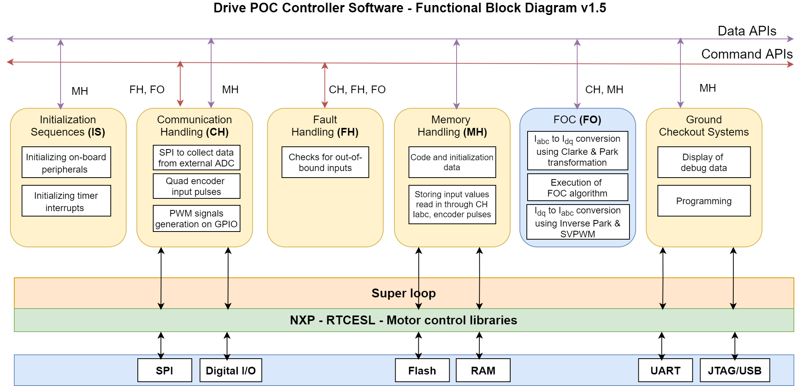

DrivePOCController_NXP + DrivePOCController Software

This a Embedded-C based software for AC Induction Motor Controller used in the POC version of the Drive project
Implementation is done here by developing the V/F Control in Embedded-C on the NXP microcontroller using the evaluation board: FRDM-KV31F. 
NXP Controller FRDM-KV31F512VLL12 provides us with few of the Motor Controller libraries and they are used here for realization

-----------------------------------------------

Software used 						:-  	MCUXpresso IDE

Version of the software used				:-	V-3.0

SDK Version used					:-	2.10.0

Version of the git commit				:-	V-0.17.4

Compiler Details					:-	GCC

Debugger Details					:-  	OpenSDA with PEMicro Debugger

Date in which the documentation was made 		:-  	28th July 2022
	
Documentation prepared by				:-	Sangeerth

People Involved in the project			:- 	Sreedhar Mahadevan, Sangeerth P

[MCUXpresso-IDE Download Link](https://www.nxp.com/design/software/development-software/mcuxpresso-software-and-tools-/mcuxpresso-integrated-development-environment-ide:MCUXpresso-IDE)

-----------------------------------------------

Software architecture V-1.5- Block diagram aiding for better understanding:

@image latex DrivePOCController_Doxydoc_Images/software_func_block_dia.jpg

-----------------------------------------------

The software implementation is split across the following files:

The DrivePOC_CommHandler has the functions that are associated with Communication of the NXP Microcontroller through its peripherals to the external world.

	DrivePOC_CommHandler.c && DrivePOC_CommHandler.h

The DrivePOC_MemHandler has the functions that are associated with storing the values of data collected from the external world
Here the MCU collects data from ADS Board to measure stator current, DC Bus current, DC Bus Voltage and stator voltages

	DrivePOC_MemHandler.c && DrivePOC_MemHandler.h

The DrivePOC_Control_Loop has the functions associated with the V/f Algorithm Implementation for Acceleration, Steady State and Deceleration phase

	DrivePOC_Control_Loop.c && DrivePOC_Control_Loop.h

The DrivePOC_Controller_NXP has the main function and the PIT Interrupt functions to schedule the actions in a timed fashion

	DrivePOC_Controller_NXP.c && DrivePOC_Controller_NXP.h

The DrivePOC_FaultHandler has the functions associated with the fault handling. For now, the fault is handled by disabling the PWM. Later on, based on ECU demands this file have to be modified.

	DrivePOC_FaultHandler.c && DrivePOC_FaultHandler.h 

The Drive_Parameters has the Parameters of the LOX Motor-V1.5.1, Sensor data(assumed-V1.0), Mosfet Data(taken from SiC Mosfet Datasheet)

	Drive_Parameters.h

The DrivePOC_Common_Header contains the structures and other datatypes that will be shared accross files.

	DrivePOC_Common_Header.h
	
	
-----------------------------------------------
